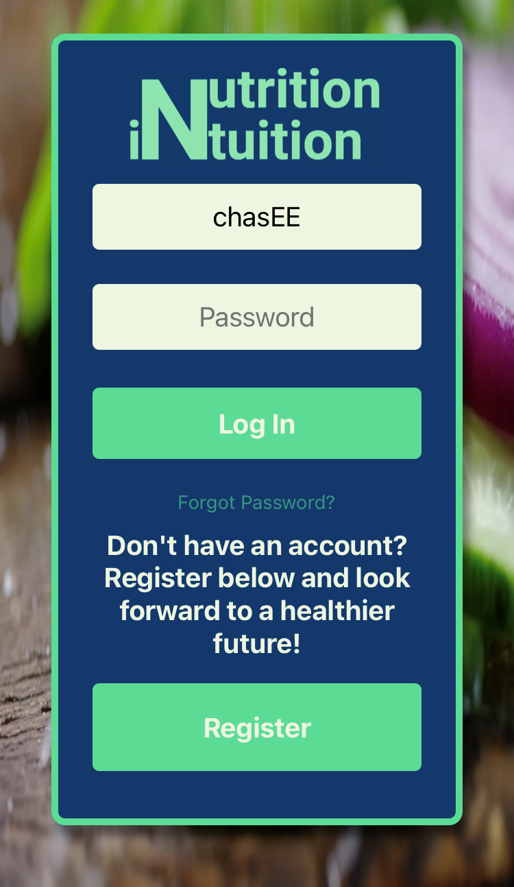
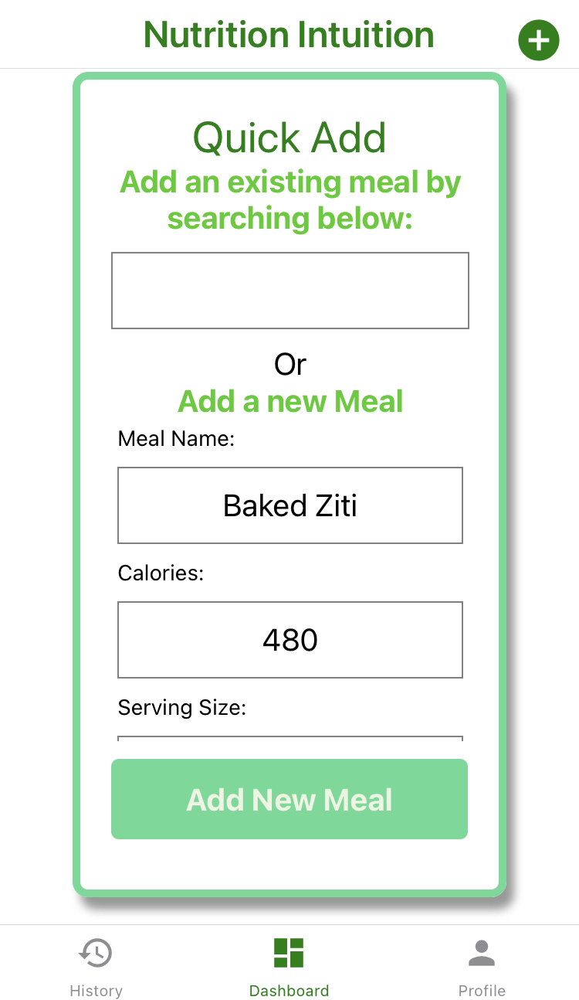
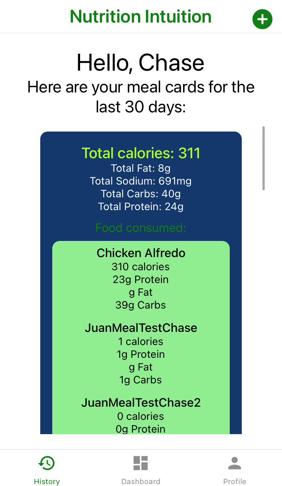

  

  
  
  
  
  

# Nutrition Intuition

Make tracking meals, calories, and macronutrients easy with Nutrition Intuition's mobile app.

<table>
  <tr>
    <th width="25%">Login/Register</th>
    <th width="25%">Dashboard</th>
    <th width="25%">Quick Add</th>
    <th width="25%">History</th>
  </tr>
  <tr>
    <td width="25%" align="center"><figure><figcaption>Acess your data online, on <a href="https://github.com/ThechasEE/NutritionIntuition">web</a> and <a href="https://github.com/juangutierrez01/nutrition-intuition-mobile">mobile</a></figcaption></figure></td>
    <td width="25%" align="center"><figure><figcaption>Keep track of your daily macronutrients and calories</figcaption></figure></td>
    <td width="25%" align="center"><figure><figcaption>Add meal information quickly and easily</figcaption></figure></td>
    <td width="25%" align="center"><figure><figcaption>Keep track of your progress across the month</figcaption></figure></td>
  </tr>
</table>
